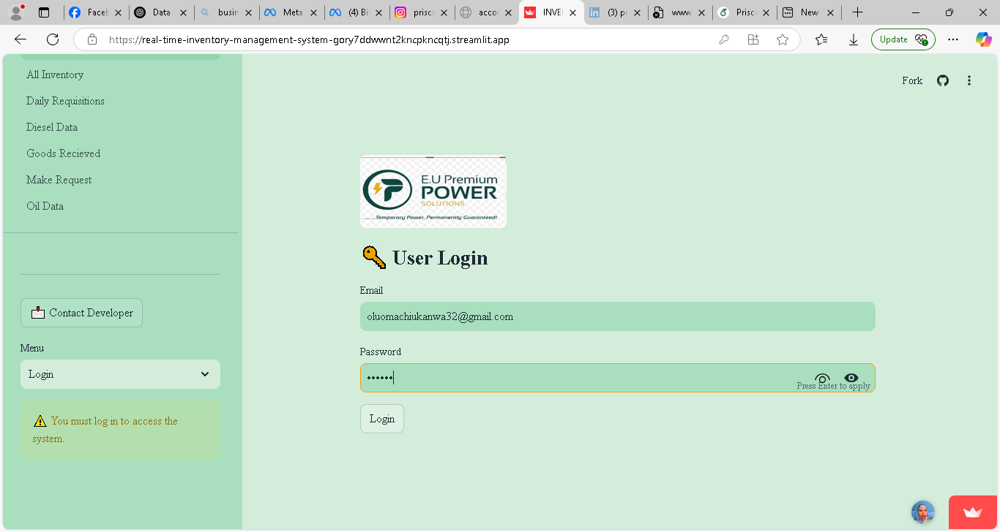

# HI,I'm Prisca!
## Data Scientist
##### 📧 oluomachiukanwa32@gmail.com   📱 +2347037567690
  

# WHAT I OFFER
- Programming Languages: Python, SQL
- Libraries : Pandas, NumPy, Scikit-Learn, TensorFlow, Keras, 
- Data Visualization: Matplotlib, Seaborn,plotly
- Machine Learning: Supervised/Unsupervised learning,NLP, Time Series Analysis, Clustering 
- Deep Learning: LSTM, computer vision,cnn,Ann,Image classification,Object detection
- Tools & Platforms: Jupyter Notebooks, Google Colab
- Databases: Postgres Sql
- Model Development: Streamlit,fastapi,Django, AWS, Render, Streamlit cloud
- Other Skills: Data Cleaning, Model Evaluation,Web scrapping, Model Deployment,Hypothesis testing

# [PROJECTS](https://github.com/Pritex32?tab=repositories)
## [Stock prediction App](https://github.com/Pritex32/forex-prediction-app-streamlit)                      (Sep 21,2024)
I Developed a Stock Price Prediction App using Streamlit, TensorFlow, and Yahoo Finance API to forecast GBP/USD exchange rates. The app retrieves real-time and historical forex data, applies LSTM-based deep learning models, and provides daily and hourly price forecasts. Integrated interactive visualizations for trend analysis, moving averages, and forecast validation. Implemented data preprocessing, model evaluation, and caching mechanisms for efficient performance.

.png)

## [Multi Image Classification Model App ](Pritex32/multi-cancer-tumor-image-classification-models)                    (Sep 13,2024)  
- Developed a convolutional neural network (CNN) model to classify lung cancer, brain tumors, and kidney stones with over 90% accuracy.
- Utilized a dataset sourced from Kaggle, applying image preprocessing techniques to enhance model performance.
- Built and deployed the model using Streamlit for real-time predictions, enabling early diagnosis and supporting healthcare professionals.
- Designed the model as a decision-support tool to improve healthcare outcomes, reduce costs, and facilitate personalized treatment plans.
- Deployed to [streamlit cloud](https://multi-cancer-tumor-image-classification-models-cexxm7g9a45cgga.streamlit.app/)

  
.png)

## [Cloud Based Inventory Management System](https://github.com/Pritex32/real-time-inventory-management-system/)      (April 1st, 2025)

Developed and deployed a cloud-based inventory management system tailored to the operational structures of small to medium-sized businesses, including retail stores, supermarkets, warehouses, and pharmacies. The system offers real-time stock tracking, low-stock alerts, customizable inventory categories, reporting and analytics features, and secure data handling.

- Designed with a user-friendly interface for easy adoption across teams.

- Integrated automated alerts and reporting tools to improve efficiency and reduce stock-related losses.

- Enabled remote access through secure cloud hosting, enhancing flexibility and data safety.

- Gathered client requirements to deliver personalized inventory solutions.

- Supported over 5 businesses in optimizing their inventory operations.

- Tools_used:  Python, supabase, Streamlit
  [link](https://real-time-inventory-management-system-gory7ddwwnt2kncpkncqtj.streamlit.app/)

## Education
- Bachelor of Science                                                                             
- Faculty of Business Administration, department of Banking and Finance

## Certification                                                                           
- 2025 Deploy ML Model in Production – [Udemy]
- Deep Learning A_Z 2025: Neural networks, AI & Machine Learning – [Udemy]
- SQL bootcamp-MySql for beginner to advanced – [Udemy]
- Statistics and Hypothesis Testing for data science – [Udemy]

