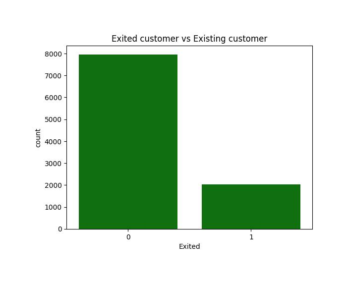

# HI,I'm Prisca!
## Data Scientist
##### 📧 oluomachiukanwa32@gmail.com   📱 +2347037567690
🔗 https://www.linkedin.com/in/prisca-ukanwa-800a1117a/

# WHAT I OFFER
- Programming Languages: Python, SQL
- Libraries : Pandas, NumPy, Scikit-Learn, TensorFlow, Keras, 
- Data Visualization: Matplotlib, Seaborn,plotl
- Machine Learning: Supervised/Unsupervised learning,NLP, Time Series Analysis, Clustering 
- Deep Learning: LSTM, computer vision,cnn,Ann,Image classification,Object detection
- Tools & Platforms: Jupyter Notebooks, Google Colab
- Databases: Progres Sql
- Model Development: Streamlit,fastapi,Django, AWS, Render, Streamlit cloud
- Other Skills: Data Cleaning, Model Evaluation,Web scrapping, Model Deployment,Hypothesis testing

# PROJECTS
## [Stock prediction App](https://github.com/Pritex32/forex-prediction-app-streamlit)                      (Sep 21,2024)
I Developed a Stock Price Prediction App using Streamlit, TensorFlow, and Yahoo Finance API to forecast GBP/USD exchange rates. The app retrieves real-time and historical forex data, applies LSTM-based deep learning models, and provides daily and hourly price forecasts. Integrated interactive visualizations for trend analysis, moving averages, and forecast validation. Implemented data preprocessing, model evaluation, and caching mechanisms for efficient performance.

.png)

## [Mult Image Classification Model App ](Pritex32/multi-cancer-tumor-image-classification-models)                    (Sep 13,2024)  
- Developed a convolutional neural network (CNN) model to classify lung cancer, brain tumors, and kidney stones with over 90% accuracy.
- Utilized a dataset sourced from Kaggle, applying image preprocessing techniques to enhance model performance.
- Built and deployed the model using Streamlit for real-time predictions, enabling early diagnosis and supporting healthcare professionals.
- Designed the model as a decision-support tool to improve healthcare outcomes, reduce costs, and facilitate personalized treatment plans.
- Deployed to streamlit cloud on the link ()

## [Lung Cancer Prediction and Analysis ](https://github.com/Pritex32/lung-cancer-prediction)      (Sep 26, 2024)

3 models were built in order to choose the model that best fit the prediction.
- Random Forest (Accuracy: 99.5% on training set, 85.7% on test set). Naive Bayes (Accuracy: 86.8% on
training set, 83.9% on test set). Logistic Regression (Accuracy: 91.8% on training set, 83.9% on test set).
- Logistic Regression was chosen due to its performance and fit in the training set and validation set .
- Logistic Regression was chosen as the final model, considered to fit well for lung cancer detection.
- The model aims to assist hospitals or individuals in detecting early-stage lung cancer, potentially preventing
worse outcomes .
- The model will enable the employees to easily check and admit lung cancer patient by inputing few features
into the model.
- If the model were to be deployed to individuals, it will enable individuals to quickly check and monitor their
health .
- Library Used: Pandas,matplotlib,Seaborn,sklearn
  

## Education
- Bachelor of Science                                                                             
- GPA 3.5(Upper Division)
- Faculty of Business Administration, department of Banking and Finance

## Certification                                                                           
- Deep learning course certificate (Udemy)
- Data science and AI machine learning Course (Udemy)
- Python (Udemy)

